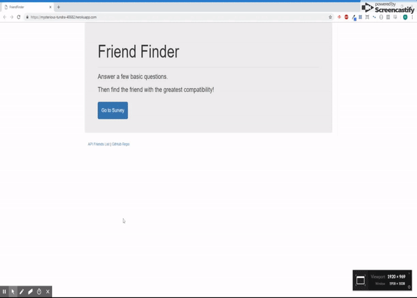
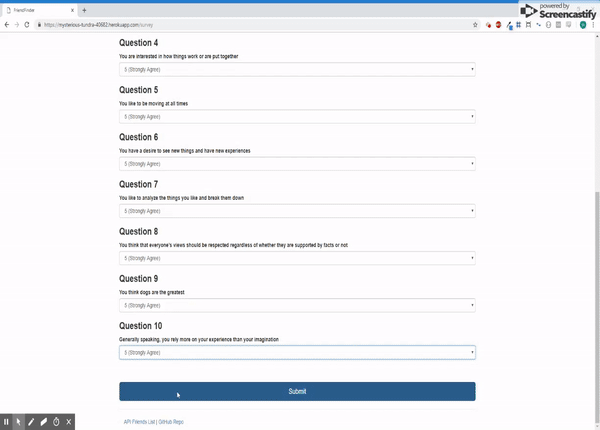

# FriendFinder

### A compatibility-based "FriendFinder" application -- basically a dating app. This full-stack site will take in results from user survey input, then compare their answers with those from other users. The app will then display the name and picture of the user with the best overall match

## Technologies Used
Express, Node.js, Javascript, HTML, Bootstrap, Heroku

## *Home Page*

#### App main page. Button that links to Survey Page. Other links to API Friends List (list of friends as JSON objects) and Github Repository

## *Survey*

#### Input for name and photo link. List of 10 questions for compatibility.
Submit button brings up a modal of the best match

Best match is found by looping through scores of other users and comparing the difference between the score of each question

##### *Deplyed on Heroku*